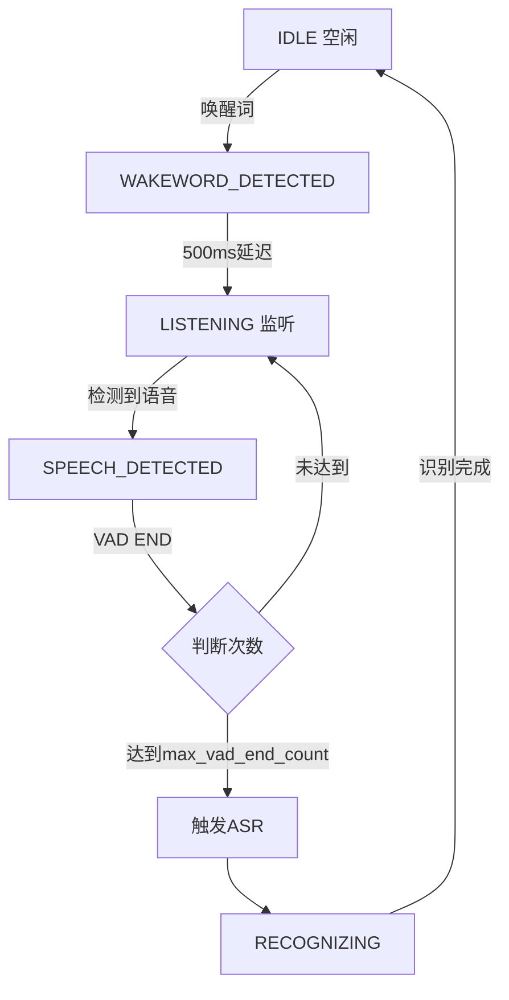

# 🥝 Kiwi 语音助手

基于事件驱动架构的智能语音助手系统

## 🏗️ 核心架构设计

### 系统总览

```
┌─────────────────────────────────────┐
│     SystemController (中央总线)      │
│  • 模块注册与管理                     │
│  • 事件发布与订阅                     │
│  • 状态协调                          │
└─────────────────────────────────────┘
            │
  ┌─────────┼─────────┬────────┬────────┐
  ▼         ▼         ▼        ▼        ▼
┌──────┐ ┌──────┐ ┌──────┐ ┌──────┐ ┌──────┐
│Audio │ │Wake  │ │ VAD  │ │ ASR  │ │ GUI  │
│      │ │word  │ │      │ │      │ │      │
└──────┘ └──────┘ └──────┘ └──────┘ └──────┘
```

### 设计原则

1. **完全解耦**: 模块之间无直接依赖，通过事件通信
2. **事件驱动**: 所有模块通信通过中央事件总线
3. **统一接口**: 所有模块实现 `IModule` 接口
4. **状态管理**: 集中式状态机管理语音处理流程
5. **可扩展**: 通过适配器模式轻松接入新模块

## 📦 核心模块

### 1. SystemController (系统控制器)

**职责:**
- 模块生命周期管理（注册、初始化、启动、停止）
- 事件总线（发布/订阅机制）
- 状态协调（通过 VoiceStateManager）

**核心方法:**
```python
controller.register_module(module)    # 注册模块
controller.publish_event(event, data) # 发布事件
controller.initialize_all(config)     # 初始化所有模块
controller.start_all()                # 启动所有模块
```

### 2. Audio Module (音频模块)

**职责:**
- 音频采集（麦克风输入）
- 音频流分发（发布 AUDIO_FRAME_READY 事件）

**事件:**
- 发布: `AUDIO_FRAME_READY` - 音频帧准备就绪

### 3. Wakeword Module (唤醒词模块)

**职责:**
- 唤醒词检测（基于 OpenWakeWord）
- 触发系统进入监听状态

**事件:**
- 订阅: `AUDIO_FRAME_READY`
- 发布: `WAKEWORD_DETECTED` - 检测到唤醒词

### 4. VAD Module (语音活动检测)

**职责:**
- 检测语音开始和结束
- 唤醒后延迟机制（500ms）
- 连续静音判定（1000ms）

**事件:**
- 订阅: `AUDIO_FRAME_READY`, `WAKEWORD_DETECTED`, `WAKEWORD_RESET`
- 发布: `VAD_SPEECH_START`, `VAD_SPEECH_END`

**关键逻辑:**
```python
# 唤醒后延迟 500ms 开始 VAD 检测
wakeword_delay_ms = 500

# 连续静音 1000ms 触发 VAD END
vad_end_silence_ms = 1000
```

### 5. ASR Module (语音识别)

**职责:**
- 语音转文字（基于 Whisper）
- 音频缓冲和识别触发

**事件:**
- 订阅: `AUDIO_FRAME_READY`, `VAD_SPEECH_START`, `VAD_SPEECH_END`
- 发布: `ASR_RECOGNITION_SUCCESS`, `ASR_RECOGNITION_FAILED`

### 6. GUI Module (图形界面)

**职责:**
- 实时波形显示
- FFT 频谱分析
- VAD 状态可视化
- ASR 结果展示

**事件:**
- 订阅: 所有事件（用于显示）

### 7. VoiceStateManager (状态机)

**职责:**
- 管理语音处理流程状态
- 状态转换逻辑
- VAD END 计数和重置

**状态定义:**
```python
IDLE              # 空闲，等待唤醒词
WAKEWORD_DETECTED # 检测到唤醒词
LISTENING         # 监听中
SPEECH_DETECTED   # 检测到语音
RECOGNIZING       # 识别中
```

## 🔄 系统流程

### 完整交互流程

```
1. 系统启动
   └─> [IDLE] 等待唤醒词

2. 用户说"小智同学"
   └─> Wakeword 检测
       └─> 发布 WAKEWORD_DETECTED
           └─> [WAKEWORD_DETECTED]

3. 延迟 500ms
   └─> VAD 开始检测
       └─> [LISTENING]

4. 用户开始说话
   └─> VAD 检测到语音
       └─> 发布 VAD_SPEECH_START
           └─> [SPEECH_DETECTED]
           └─> ASR 开始缓冲音频

5. 用户说话中...
   └─> 持续采集音频帧

6. 连续静音 1000ms
   └─> VAD 触发结束
       └─> 发布 VAD_SPEECH_END
           └─> [IDLE] (max_vad_end_count=1)
           └─> ASR 开始识别

7. ASR 识别完成
   └─> 发布 ASR_RECOGNITION_SUCCESS
       └─> GUI 显示结果

8. 返回 [IDLE]
   └─> 等待下一次唤醒
```

### 状态转换图



### 事件流程图

```
AUDIO采集
    ↓
AUDIO_FRAME_READY 事件
    ↓
    ├─> Wakeword 模块
    │   └─> WAKEWORD_DETECTED 事件
    │       └─> 状态机: IDLE → WAKEWORD_DETECTED
    │
    ├─> VAD 模块
    │   ├─> VAD_SPEECH_START 事件
    │   │   └─> 状态机: LISTENING → SPEECH_DETECTED
    │   └─> VAD_SPEECH_END 事件
    │       └─> 状态机: SPEECH_DETECTED → IDLE
    │       └─> 触发 ASR
    │
    └─> ASR 模块
        └─> ASR_RECOGNITION_SUCCESS 事件
            └─> GUI 显示结果
```

## 🎯 关键配置

### VAD 配置
```yaml
vad:
  settings:
    wakeword_delay_ms: 500      # 唤醒后延迟
    vad_end_silence_ms: 1000    # 静音判定时长
    frame_duration_ms: 30       # 帧时长
    aggressiveness: 2           # 激进度 (0-3)
```

### 状态机配置
```python
StateConfig(
    enable_wakeword=True,       # 启用唤醒词
    max_vad_end_count=1,        # 一次 VAD END 就重置
    wakeword_timeout=10.0       # 唤醒超时时间
)
```

## 🚀 快速启动

```bash
# 安装依赖
pip install -r requirements.txt

# 启动 GUI
python main.py
```

## 📊 GUI 状态显示

| 状态 | 显示 | 说明 |
|------|------|------|
| 就绪 | `Status: ready` | 系统监听中 |
| 唤醒 | `Status: wake up` | 检测到唤醒词 |
| VAD开始 | `Status: vad begin` | 检测到语音活动 |
| VAD结束 | `Status: vad end` | 语音活动结束 |
| 返回就绪 | `Status: ready` | 100ms后自动切换 |

## 📁 项目结构

```
kiwi/
├── src/
│   ├── core/                   # 核心框架
│   │   ├── controller.py       # 系统控制器
│   │   ├── events.py           # 事件定义
│   │   └── interfaces.py       # 模块接口
│   ├── adapters/               # 模块适配器
│   │   ├── audio_adapter.py
│   │   ├── wakeword_adapter.py
│   │   ├── vad_adapter.py
│   │   ├── asr_adapter.py
│   │   └── gui_adapter.py
│   ├── state_machine/          # 状态机
│   │   ├── manager.py
│   │   └── types.py
│   ├── audio/                  # 音频引擎
│   ├── wakeword/               # 唤醒词引擎
│   ├── vad/                    # VAD 引擎
│   ├── asr/                    # ASR 引擎
│   └── gui/                    # GUI 界面
├── config/                     # 配置文件
├── models/                     # 模型文件
└── main.py                     # 程序入口
```

## 🎨 技术栈

- **事件系统**: 自研事件总线
- **唤醒词**: OpenWakeWord
- **VAD**: WebRTC VAD
- **ASR**: OpenAI Whisper
- **GUI**: PyQt5 + pyqtgraph
- **音频**: PyAudio

## 📄 许可

MIT License
